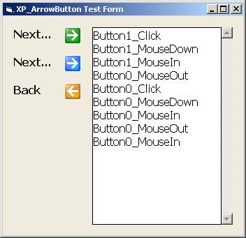

<div align="center">

## XP ArrowButton


</div>

### Description

This is a simple arrow button control with an XP style. It gots 3 different look. It also generates 4 events: Click, MouseDown, MouseIn and MouseOut.

I don't want vote, I just wanna share in case it can be usefull to somebody. Any comments are welcome.
 
### More Info
 


<span>             |<span>
---                |---
**Submitted On**   |2004-12-31 01:15:06
**By**             |[Le King Des Kings](https://github.com/Planet-Source-Code/PSCIndex/blob/master/ByAuthor/le-king-des-kings.md)
**Level**          |Beginner
**User Rating**    |4.6 (23 globes from 5 users)
**Compatibility**  |VB 6\.0
**Category**       |[Custom Controls/ Forms/  Menus](https://github.com/Planet-Source-Code/PSCIndex/blob/master/ByCategory/custom-controls-forms-menus__1-4.md)
**World**          |[Visual Basic](https://github.com/Planet-Source-Code/PSCIndex/blob/master/ByWorld/visual-basic.md)
**Archive File**   |[XP\_ArrowBu18347112312004\.zip](https://github.com/Planet-Source-Code/le-king-des-kings-xp-arrowbutton__1-58004/archive/master.zip)

### API Declarations

```
Private Declare Function GetCursorPos Lib "user32" (lpPoint As POINT_API) As Long
Private Declare Function ScreenToClient Lib "user32" (ByVal hWnd As Long, lpPoint As POINT_API) As Long
```


